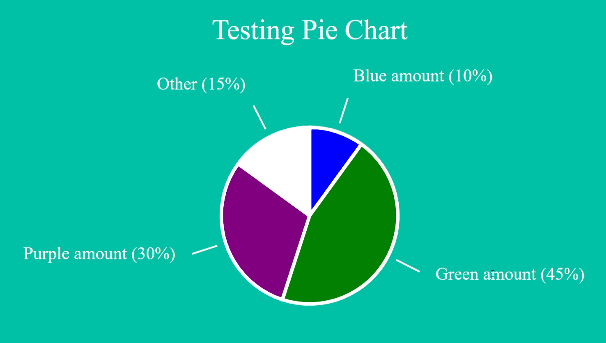

# Vue Pie Chart

[](https://travis-ci.org/tylergrinn/vue-pie-chart)

## [DEMO](https://vue-pie-chart.surge.sh)

A simple no-nonsense pie chart optimized for VueJS



## Installation

### Yarn
```
yarn add -D @tygr/vue-pie-chart
```
```js
import PieChart from '@tygr/vue-pie-chart'

export default {
  components: {
    PieChart,
  }
}
```

### Browser
```html
<script type="text/javascript" src="https://cdn.jsdelivr.net/npm/vue/dist/vue.js"></script>
<script src="https://unpkg.com/@tygr/vue-pie-chart/dist/vue-pie-chart.min.js" charset="utf-8"></script>
<script>
  Vue.use(PieChart)
</script>
```

* Charset attribute required

## Usage

```html
<pie-chart :plot="plot"></pie-chart>
```
```js
export default {
  data: () => ({
    plot: [
      {
        value: 10,
        color: 'blue',
        label: 'Blue amount',
        id: 1
      },
      {
        value: 45,
        color: 'green',
        label: 'Green amount',
        id: 2
      },
      {
        value: 30,
        color: 'purple',
        label: 'Purple amount',
        id: 3
      }
    ]
  })
}
```

## Events

| event | payload | description                          |
| ----- | ------- | ------------------------------------ |
| click | any     | Emits the id of a datum when clicked |

## Props

| prop             | type   | default | description           |
| ---------------- | ------ | ------- | --------------------- |
| plot             | array  | []      | The plot data to show | 
| background-color | string | 'grey'  | The background color  |
| color            | string | 'white' | Text and border color |

## Datum properties

| prop  | type   | description                               |
| ----- | ------ | ----------------------------------------- |
| value | number | percentage out of 100                     |
| color | string | background color for the circle segment   |
| label | string | label for the segment                     |
| id    | any    | Identifier to be used for the click event |